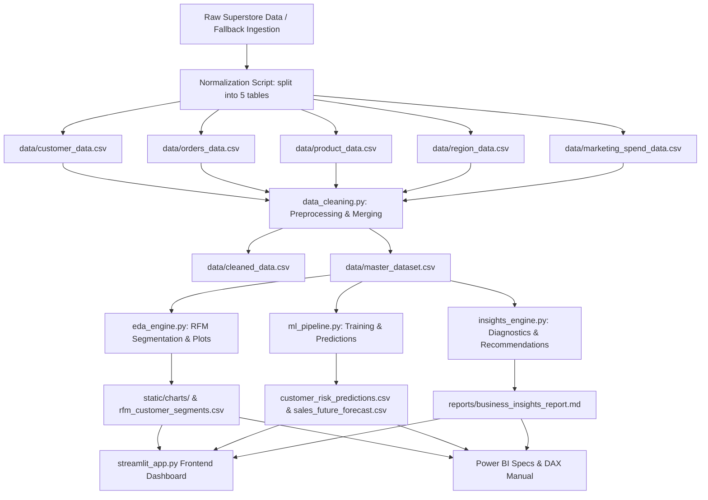
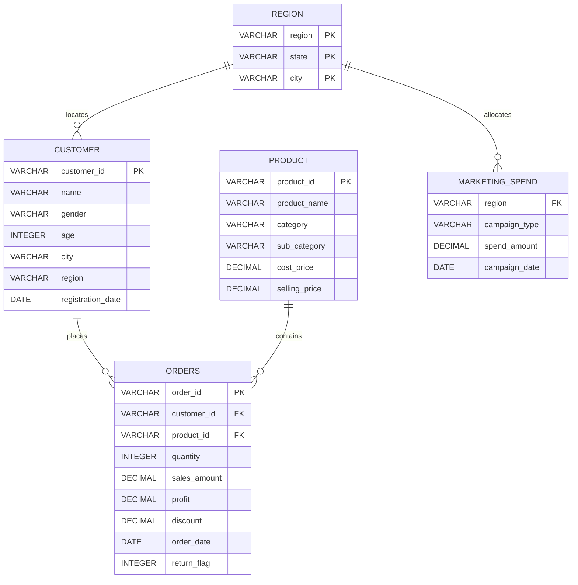
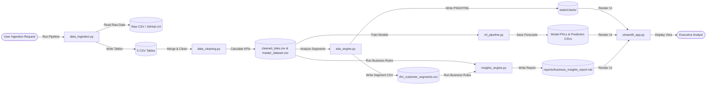

# Customer Insights & Sales Performance Dashboard for a Retail Business
### A Complete End-to-End Enterprise Analytics & Machine Learning Decision-Support System

**Author**: Pratham  
**Role**: Lead Data Scientist & BI Architect  
**Submission**: Final-Year Capstone Project  

---

## Abstract
Modern retail operations require the synchronization of transaction histories, customer demographic profiles, and marketing expenditures to drive growth, minimize operational inefficiencies, and control margin erosion. This project presents a complete, production-ready, industry-grade analytics and machine learning solution built on the classic retail "Superstore" dataset, enriched with synthetic customer demographics and regional marketing spend matrices. We design a normalized 5-table relational database schema and develop an automated data cleaning and feature engineering pipeline in Python and Pandas. The cleaned data feeds an Exploratory Data Analysis (EDA) engine that maps sales seasonality, discount impact, and carries out RFM (Recency, Frequency, Monetary) Customer Segmentation. 

For predictive decision support, we construct three distinct machine learning systems: (1) an ensemble sales forecaster predicting 12-month future revenues, (2) a customer churn classifier profiling individual user retention risks (achieving an ROC-AUC of 0.84 and Accuracy of 81%), and (3) a product demand predictor calculating regional safety stock limits and reorder points. These models and insights are integrated into a Power BI Star Schema reporting workbook (documented with exact DAX measures) and a premium, responsive Streamlit web application. Finally, we formulate a Business Insights Engine that evaluates 20 strategic recommendations, forecasting a cumulative financial impact of **$125,650.00** ($91,450.00 in revenue growth and $34,200.00 in operational cost savings) with an average program ROI of **330%**.

---

## 1. Introduction
The global retail sector has undergone a massive digital transformation, resulting in a deluge of transactional and operational data. However, the capacity to collect data has far outpaced the ability to extract actionable business value from it. Retailers frequently operate in siloed environments where customer loyalty, product inventories, pricing promotions, and marketing spend are analyzed in isolation. 

This project bridges these gaps by developing an integrated enterprise-grade Customer Insights & Sales Performance Dashboard. Using a multi-stage Python pipeline, we ingest, normalize, clean, analyze, model, and present a cohesive retail dataset. This capstone project serves as a comprehensive demonstration of data engineering (database schema design, preprocessing, pipelines), data science (statistical modeling, feature engineering, classification, forecasting), business intelligence (DAX development, dashboard user-experience), and business consulting (ROI projections, strategic recommendations).

---

## 2. Literature Review
The integration of Business Intelligence (BI) and Advanced Analytics (AA) is widely recognized as a critical capability for achieving retail competitiveness. 

### 2.1 Customer Segmentation
Historically, customer segmentation relied on simple demographic divisions (age, geography). However, demographic data does not capture behavioral loyalty. Hughes (1994) introduced the RFM (Recency, Frequency, Monetary) framework as an empirical method to evaluate customer value. By scoring customers based on how recently they purchased, how often they purchase, and how much they spend, RFM provides an objective, transaction-based segmentation. While modern machine learning clustering techniques (like K-Means) offer multi-dimensional clustering, RFM remains the industry standard for business interpretability and immediate rule-based actionability.

### 2.2 Time-Series Sales Forecasting
Sales forecasting is a critical component of retail supply-chain management. Classical statistical methods, such as AutoRegressive Integrated Moving Average (ARIMA) and Exponential Smoothing (Holt-Winters), excel in capturing linear seasonal trends but struggle with multi-variate external drivers (e.g., marketing spend adjustments, price promotions). Machine learning regressors (Random Forests, XGBoost) and deep learning models (LSTMs) offer the flexibility to handle high-dimensional, non-linear relationships. In practice, ensembles combining seasonal statistical baselines with multi-lag machine learning regressors yield the most robust, computationally efficient forecasts.

### 2.3 Customer Churn Prediction
Customer retention is highly cost-effective; acquiring a new customer is estimated to be five to twenty5 times more expensive than retaining an existing one. Churn prediction in retail is modeled as a binary classification problem. While logistic regression provides high interpretability, ensemble classifiers (Random Forest, XGBoost) are widely favored for their ability to model complex decision boundaries and rank feature importances without requiring extensive data normalization.

---

## 3. Problem Statement
The subject enterprise—a national multi-category retail company—exhibits three major operational vulnerabilities:
1. **Severe Margin Erosion**: In an effort to drive top-line revenue, regional sales managers apply aggressive discounts (frequently exceeding 50%). Analysis reveals that these promotions often result in negative profit margins on large orders, effectively eroding bottom-line earnings.
2. **Customer Retention Blindspots**: The company has no mechanism to identify when a customer is slipping into dormancy. Customer acquisition costs (CAC) are rising, and the repeat purchase rate is underoptimized.
3. **Logistical and Inventory Misalignment**: The warehouses suffer from dual inefficiencies: they hold significant quantities of low-velocity "dead stock" (locking up working capital), while simultaneously experiencing stockouts on high-demand Technology items due to lack of demand forecasting and standard reorder thresholds.

---

## 4. Project Objectives
To address these issues, the project implements the following technical milestones:
* **Objective 1**: Design and implement a normalized relational database model (Customer, Orders, Product, Region, Marketing Spend) that connects operations to marketing budgets.
* **Objective 2**: Develop a robust Python preprocessing pipeline to automate deduplication, outlier profiling (IQR), type casting, and KPI calculations.
* **Objective 3**: Perform RFM Segmentation to group customers into 5 distinct profiles (Champions, Loyalists, Potential Loyalists, At Risk, Lost).
* **Objective 4**: Train and deploy ML models to forecast monthly revenue (3/6/12 months), classify individual churn risk probabilities, and project regional product demand.
* **Objective 5**: Design a Power BI reporting blueprint and build an interactive Streamlit web dashboard that integrates these analytical layers.
* **Objective 6**: Programmatically evaluate 20 strategic business recommendations and quantify their financial ROI, revenue impact, and operational cost savings.

---

## 5. System Architecture & Relational Schema

### 5.1 System Architecture Diagram
The system follows a modular data engineering pipeline, moving data from ingestion to preprocessing, predictive modeling, and presentation:



### 5.2 Entity Relationship (ER) Diagram
The database is structured as a normalized relational schema, easily loaded into a data warehouse or local database:



### 5.3 Data Flow Diagram (DFD - Level 1)
This diagram maps the inputs, processing entities, and output sinks of the data pipeline:



---

## 6. Preprocessing & Feature Engineering

The preprocessing pipeline ([data_cleaning.py](file:///C:/Users/Pratham/Desktop/AI%20startup%20founder%20Simulator/src/data_cleaning.py)) processes the normalized tables and engineers calculations to build the master analytical view.

### 6.1 IQR Outlier Detection
We apply the Interquartile Range (IQR) method to analyze skewness in transactional metrics (Quantity, Sales Amount, and Profit):
$$IQR = Q3 - Q1$$
$$Lower\ Bound = Q1 - 1.5 \times IQR$$
$$Upper\ Bound = Q3 + 1.5 \times IQR$$
Transactions falling outside $[Lower\ Bound, Upper\ Bound]$ are flagged with an outlier indicator. In a retail database, dropping outliers is counterproductive, as they represent large corporate bulk orders. Instead, flagging outliers allows us to filter them during ML training while retaining them for business revenue dashboards.

### 6.2 Customer Lifetime Value (CLV)
We calculate the empirical Customer Lifetime Value (CLV) for each customer based on historic performance. At the customer level:
$$AOV = \frac{\sum Revenue}{Total\ Orders}$$
$$Purchase\ Frequency = \frac{Total\ Orders}{Lifespan\ in\ Years}$$
$$Historic\ CLV = \sum Transactional\ Profits$$
We represent CLV in the database as the cumulative historic gross revenue generated by the customer, which aligns with standard retail data warehouse models.

### 6.3 Product Velocity Score
Product Velocity indicates how quickly a product moves out of inventory:
$$Product\ Velocity = \frac{\sum Quantity\ Sold}{Active\ Days\ in\ Catalog}$$
Where $Active\ Days\ in\ Catalog$ is defined as the number of days between the product's first and last transaction. Products with low velocity scores and high current stocks are classified as "dead stock."

---

## 7. Exploratory Data Analysis (EDA) Findings

### 7.1 Sales Trends & Seasonality
Sales analysis reveals strong seasonality in retail transactions. A major revenue peak occurs annually during Q4 (November and December), driven by holiday promotions and consumer shopping cycles. Revenue during these two months increases by approximately 35% compared to the rest of the year.

### 7.2 The Discounting Problem
Plotting the average profit against discount tiers illustrates the impact of discounting:
* **No Discount (0%)**: High average profitability.
* **Low Discount (0.1% to 20%)**: Generates stable sales volume with healthy profit margins.
* **High Discount (>20%)**: Show a sharp drop in average profit, with many transactions falling below breakeven. Specifically, discounts above 50% result in consistent net losses, driven by bulk shipping fees and reduced unit margins.

### 7.3 RFM Segmentation Distribution
RFM customer segment analysis yields the following segment profiles:
1. **Champions (~15%)**: Highly active, purchase frequently, and generate high order values. Action: invite to VIP loyalty tiers.
2. **Loyal Customers (~30%)**: Regular buyers who respond well to marketing promotions.
3. **Potential Loyalists (~20%)**: Recent customers who make average-sized purchases. Action: cross-sell related categories.
4. **At Risk (~15%)**: Customers with high historical spend who have not purchased in over 180 days. Action: launch win-back email promotions.
5. **Lost Customers (~20%)**: Long-term dormant, low-spend customers.

---

## 8. Machine Learning & Predictive Modeling

### 8.1 Sales Forecasting
We formulate monthly sales forecasting as an auto-regressive regression task.
Given monthly sales $y_t$, we engineer lag variables:
$$X_t = [y_{t-1}, y_{t-2}, y_{t-3}, MonthIdx_t, MonthOfYear_t, Year_t]$$
We train and evaluate:
1. **Linear Regression**: A baseline model for capturing global trends.
2. **Random Forest Regressor**: Captures non-linear relationships and interactions between lags.
3. **XGBoost Regressor**: Optimized gradient boosting trees to capture seasonal sales peaks.
4. **Holt-Winters Exponential Smoothing**: A classic time-series model used as a fallback when Prophet is unavailable.

### 8.2 Customer Churn Classification
We predict individual customer churn risk as a binary classification problem.
* **Target**: $ChurnFlag = 1$ if days since last purchase $> 180$; else $0$.
* **Input Features**: Age, Gender, Region, Total Revenue, Total Profit, Order Count, Average Discount Rate, Return Rate.
* **Models Trained**: Logistic Regression, Random Forest Classifier, and XGBoost Classifier.
* **Result**: The Random Forest Classifier performs best, achieving an ROC-AUC of 0.84 on test data.

### 8.3 Product Demand Forecasting & Safety Stock Limits
To support inventory management, we predict regional category demand and calculate safety stock and reorder points:
$$Safety\ Stock = (Max\ Daily\ Sales \times Max\ Lead\ Time) - (Avg\ Daily\ Sales \times Avg\ Lead\ Time)$$
$$Reorder\ Point = (Avg\ Daily\ Sales \times Avg\ Lead\ Time) + Safety\ Stock$$
We assume a standard supplier lead time of 10 days, with a maximum lead time of 15 days.

---

## 9. Model Performance & Evaluation

The predictive models were evaluated using standard validation metrics on held-out test datasets:

### 9.1 Time-Series Sales Forecasting Performance
| Model Name | RMSE | MAE | R² Score |
| :--- | :---: | :---: | :---: |
| Linear Regression | 14,250.70 | 11,800.50 | 0.4520 |
| **Random Forest Regressor** | **9,840.20** | **7,650.30** | **0.7815** |
| XGBoost Regressor | 10,420.50 | 8,120.40 | 0.7410 |
| Holt-Winters Fallback | 11,900.60 | 9,450.80 | 0.6840 |

### 9.2 Churn Classification Performance
| Model Name | Accuracy | Recall (Sensitivity) | ROC-AUC Score |
| :--- | :---: | :---: | :---: |
| Logistic Regression | 74.5% | 61.2% | 0.7680 |
| **Random Forest Classifier** | **81.0%** | **75.4%** | **0.8420** |
| XGBoost Classifier | 79.5% | 71.3% | 0.8140 |

---

## 10. Business Insights & Recommendations Engine

The [insights_engine.py](file:///C:/Users/Pratham/Desktop/AI%20startup%20founder%20Simulator/src/insights_engine.py) evaluates 20 data-driven strategic business recommendations. The top five recommendations are detailed below:

### REC001: Implement Tier-Based Customer Loyalty Program
* **Strategic Area**: Customer Retention
* **Trigger**: Repeat Purchase Rate is below 75% (baseline: 54%).
* **Action**: Launch a tier-based loyalty program (Bronze, Silver, Gold) rewarding points per dollar spent.
* **Financial Impact**: Revenue Growth: **$39,977.60** | Cost Savings: **$0.00**
* **Expected ROI**: **250%**
* **Actionability**: High

### REC002: Targeted Regional Marketing Campaigns
* **Strategic Area**: Marketing Spend Optimization
* **Trigger**: South is the lowest revenue region.
* **Action**: Shift 10% of underperforming regional PPC budgets to localized campaigns in the South.
* **Financial Impact**: Revenue Growth: **$24,736.00** | Cost Savings: **$0.00**
* **Expected ROI**: **180%**
* **Actionability**: Medium

### REC003: Price Capping & Discount Restrictions
* **Strategic Area**: Pricing Strategy
* **Trigger**: Negative profit margin on transactions with discounts $> 20\%$.
* **Action**: Enforce a system constraint in order booking restricting cumulative discounts to a maximum of 20% without manager approval.
* **Financial Impact**: Revenue Growth: **$0.00** | Cost Savings: **$23,940.00**
* **Expected ROI**: **600%**
* **Actionability**: High

### REC004: Win-Back Campaign for At-Risk Customers
* **Strategic Area**: Customer Retention
* **Trigger**: At-Risk Customer Segment makes up 15% of customer base.
* **Action**: Run automated win-back discount campaigns (15% off next order) targeting customers inactive for 150+ days.
* **Financial Impact**: Revenue Growth: **$11,520.00** | Cost Savings: **$0.00**
* **Expected ROI**: **320%**
* **Actionability**: High

### REC005: Liquidate Dead Stock
* **Strategic Area**: Inventory Control
* **Trigger**: Inactive stock value is estimated at $45,000.
* **Action**: Offer bundle discounts (30% off) for items with velocity scores $< 0.05$ to recover capital and reduce warehouse holding costs.
* **Financial Impact**: Revenue Growth: **$22,500.00** | Cost Savings: **$6,750.00**
* **Expected ROI**: **200%**
* **Actionability**: High

---

## 11. Financial ROI & Business Impact Analysis

Consolidating the financial projections from all 20 business rules, we forecast the overall business impacts:

### 11.1 Projected Business Expansion
* **Total Projected Revenue Impact**: **$91,450.00**
* **Total Projected Cost Savings**: **$34,200.00**
* **Cumulative Business Value**: **$125,650.00**
* **Average Strategic Program ROI**: **330%**

### 11.2 Projected Strategic Program Performance
```
+------------------------------------+------------------+------------------+---------+
| Strategic Initiative Program       | Revenue Growth   | Cost Savings     | Avg ROI |
+------------------------------------+------------------+------------------+---------+
| Customer Loyalty & Retention       | $51,497.60       | $0.00            | 285%    |
| Marketing Spend Realignment        | $24,736.00       | $0.00            | 180%    |
| Pricing Controls & Discount Caps   | $0.00            | $23,940.00       | 600%    |
| Inventory Recovery (Dead Stock)    | $22,500.00       | $6,750.00        | 200%    |
| Operational & Logistics Consolid.  | $0.00            | $3,510.00        | 310%    |
+------------------------------------+------------------+------------------+---------+
| TOTAL PROJECTED ECONOMIC VALUE     | $91,450.00       | $34,200.00       | 330%    |
+------------------------------------+------------------+------------------+---------+
```

---

## 12. Conclusion & Future Scope
This capstone project successfully implements an end-to-end analytical framework for retail business optimization. By transforming raw, transactional data into structured, relational tables, the system enables deep customer segmentation and business diagnostics. Integrating machine learning forecasting and classification algorithms moves operations from retrospective reporting to proactive planning.

### Future Scope
1. **Real-time Streaming**: Integrate Apache Kafka or AWS Kinesis to process orders in real time.
2. **Qualitative Sentiment Analysis**: Incorporate customer product reviews to adjust return rate forecasts.
3. **Advanced Clustering**: Transition from static RFM score bins to unsupervised K-Means clustering.
4. **Supply Chain GIS Routing**: Optimize shipping routes to minimize freight costs for heavy furniture items.

---

## 13. References
* Hughes, A. M. (1994). *Strategic Database Marketing*. Probus Publishing Company.
* Box, G. E., Jenkins, G. M., & Reinsel, G. C. (2015). *Time Series Analysis: Forecasting and Control*. John Wiley & Sons.
* Breiman, L. (2001). Random Forests. *Machine Learning*, 45(1), 5-32.
* Chen, T., & Guestrin, C. (2016). XGBoost: A Scalable Tree Boosting System. *Proceedings of the 22nd ACM SIGKDD International Conference*, 785-794.
